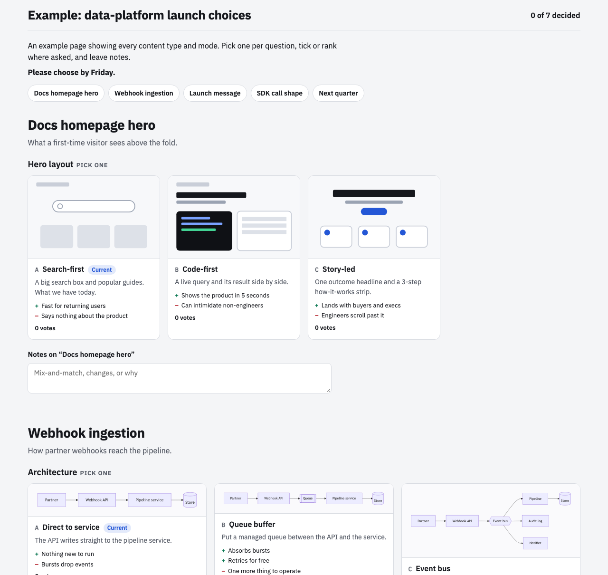

# /choices

**Decisions get made in long threads where nobody sees the alternatives side by side.** You ask for "a couple of
options", get three paragraphs, pick one, and the reasoning is gone by Friday.

`/choices` is a Claude Code skill that turns "which way should we go?" into a short loop:

**frame → 2–4 real options → a tap-to-pick page → read the picks → decision record + spec**

You see the alternatives side by side (UI mocks, Mermaid architecture diagrams, copy, code, images) and click your
pick, rank them, or tick several. Every option takes comments and every section has a notes box. Your team can vote
on the same page and watch the tallies. Claude reads the picks straight back, with no copy-paste, and writes the
decision record and the build spec.



**Requirements:** Claude Code signed in with a claude.ai account that has Artifacts (the skill uses the Artifact,
ArtifactData and ArtifactComments tools), plus Python 3. Pillow and headless Chrome are optional, for image options
and the screenshot check.

## Who can vote

| Mode | Who | How picks come back |
|---|---|---|
| `solo` | you | saved automatically |
| `team` | colleagues in your Claude organization | each person's ballot saves automatically, with live tallies and everyone's notes on the page |
| `public` | anyone with the link (clients, partners) | each person presses "Copy my choices" and sends it back |

Sharing takes one click from you: the page's **Share** menu (add people or your organization, or turn on link
sharing for `public`). The page then shows you, and only you, an **Invite your people** panel with a ready-to-paste
message. Claude can also:
- post the invite to Slack with an "Open the choices" button (see below)
- draft emails or WhatsApps to named people
- set a reminder before the deadline

Every option and section has a **Comment on …** link that opens claude.ai's comment box pinned to that card.
Claude reads those threads into the decision record and, where a thread is sent to Claude, replies with the outcome.

## Slack (one-time setup per channel)

In Slack, open *Apps → Incoming Webhooks → Add to Slack*, pick the channel, and copy the webhook URL. Then:

```bash
python3 skill/scripts/post_slack.py setup product-team https://hooks.slack.com/services/…
```

The URL is kept privately in `~/.config/choices/slack.json` (mode 600), never in this repo. Claude always shows you
the exact post first (a dry run) and only sends with `--yes` after you say so. If a Slack connector is added to
Claude later, the skill uses that instead.

## Use

Type `/choices` or `/choice`, or just ask: "show me a few directions for the pricing page", "let the team vote on
the ingestion architecture", "rank these Q4 bets".

Under the hood:

```bash
python3 skill/scripts/build_choices.py choices.json -o choices.html --screenshot check.png [--invite-url URL]
python3 skill/scripts/tally.py <votes_out_dir> choices.json
```

- `skill/SKILL.md`: the workflow Claude follows
- `skill/references/contract.md`: the JSON format, and the prompt for fanning out to helper agents
- `skill/references/options-craft.md`: how to make options worth choosing between
- `skill/references/decision-record.md`: the ADR-style record and build-spec template
- `skill/examples/example-choices.json`: a page with every content type and mode

## Install

```bash
git clone https://github.com/jhammant/choices-skill.git
ln -s "$PWD/choices-skill/skill" ~/.claude/skills/choices
ln -s "$PWD/choices-skill/alias-choice" ~/.claude/skills/choice   # optional /choice alias
```

Then restart Claude Code (or start a new session) and type `/choices`.

## License

MIT
